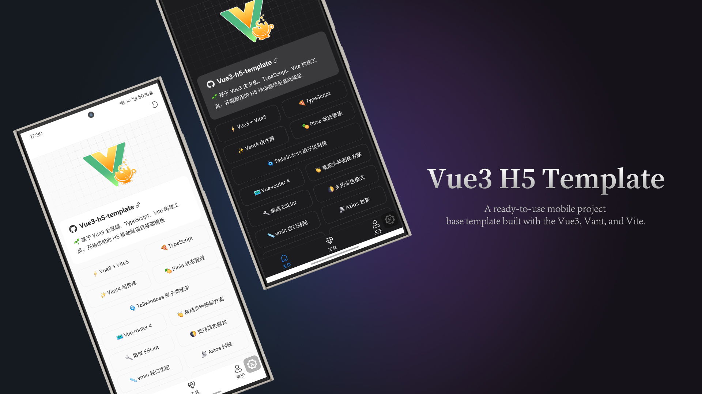

<div align="center">
  
</div>

<div align="center">
  <a href="https://github.com/yulimchen/vue3-h5-template/blob/master/LICENSE">
    
  </a>
  <a href="https://github.com/yulimchen/vue3-h5-template/releases">
    
  </a>
</div>

<h1 align="center">卡赢科技考试助手</h1>

## 项目简介

这是一个基于 **Vue3 + Vite + Vant** 的移动端 H5 考试练习系统，专门用于复习《卡赢科技产品体系命名规则考试》。

项目帮助用户：
- 系统学习卡赢科技三大核心平台（卡控、星辰、赢商城）及其专属产品
- 通过练习模式和考试模式掌握考试内容
- 导出错题本和打印速记卡片进行离线复习

---

## 项目结构

```
zhishiwenda/
├── docs/                          # 文档目录
│   ├── exam-source/               # 考试原文材料
│   └── superpowers/               # 开发规划文档
├── public/                        # 静态资源
├── src/                           # 源代码目录
│   ├── components/                # 公共组件
│   │   ├── nav-bar/               # 顶部导航栏
│   │   ├── tabbar/                # 底部标签栏
│   │   ├── svg-icon/              # SVG图标组件
│   │   └── i-icon/                # Iconify图标组件
│   ├── data/
│   │   └── exam.ts                # 核心数据：题库、知识点、配置
│   ├── enums/
│   │   └── request-enum.ts        # HTTP请求枚举
│   ├── layout/
│   │   └── index.vue              # 页面布局（导航栏+内容区+底部栏）
│   ├── router/
│   │   ├── index.ts               # 路由实例
│   │   └── routes.ts              # 路由配置
│   ├── store/                     # Pinia状态管理
│   │   ├── index.ts
│   │   └── modules/
│   │       ├── cached-view.ts     # 页面缓存状态
│   │       └── dark-mode.ts       # 深色模式状态
│   ├── styles/                    # 全局样式
│   │   ├── index.less             # 主样式入口
│   │   ├── variables.less         # CSS变量
│   │   └── tailwind.css           # TailwindCSS
│   ├── typings/                   # TypeScript类型定义
│   ├── utils/                     # 工具函数
│   │   ├── http/                  # Axios封装
│   │   ├── dark-mode.ts           # 深色模式工具
│   │   ├── progress.ts            # NProgress进度条
│   │   └── validate.ts            # 验证工具
│   ├── views/                     # 页面视图
│   │   ├── home/                  # 首页（冲刺总览）
│   │   ├── practice/              # 考试练习
│   │   ├── memory/                # 考点速记
│   │   ├── mock-exam/             # 模拟考试
│   │   ├── sprint-mode/           # 考前冲刺
│   │   ├── wrong-book-export/     # 错题本导出
│   │   ├── print-pack/            # 打印速记
│   │   ├── tools/                 # 工具页
│   │   ├── about/                 # 关于页
│   │   └── 404.vue                # 404页面
│   ├── App.vue                    # 根组件
│   ├── main.ts                    # 应用入口
│   └── settings.ts                # 全局配置
├── mock/                          # Mock数据
├── build/                         # 构建配置
├── .env.development               # 开发环境变量
├── .env.production                # 生产环境变量
├── vite.config.ts                 # Vite配置
├── tailwind.config.ts             # TailwindCSS配置
├── postcss.config.js              # PostCSS配置
├── tsconfig.json                  # TypeScript配置
└── package.json                   # 项目依赖
```

---

## 功能模块

### 1. 首页（冲刺总览）

**路径**: `/home`

**功能**:
- 展示考试基本信息（时长、总分、及格线、题型）
- 显示学习进度统计（已刷题数、正确率、错题数、最近模考分数）
- 展示当前薄弱知识点
- 考试覆盖范围要点
- 考前速过清单
- 考试场次提醒

### 2. 考试练习

**路径**: `/practice`

**功能**:
- **练习模式**：按题型、标签、难度筛选题目，支持查看答案解析
- **考试模式**：30分钟计时，顺序解锁答题，交卷评分

**支持的题型**:
- 单选题
- 多选题
- 判断题
- 填空题
- 场景题（含多个子问题）

### 3. 考点速记

**路径**: `/memory`

**功能**:
- 分标签页展示知识点卡片
- 通知摘要
- 必背高频题
- 三大平台介绍（卡控、星辰、赢商城）
- 七大产品介绍
- 典型案例场景
- 简答题参考答案

### 4. 模拟考试

**路径**: `/mock-exam`

**功能**:
- 模拟正式考试流程
- 随机组卷
- 倒计时提醒
- 答题卡展示
- 成绩评定

### 5. 考前冲刺

**路径**: `/sprint-mode`

**功能**:
- 快速浏览核心知识点
- 重点内容强调
- 考试技巧提示

### 6. 错题本导出

**路径**: `/wrong-book-export`

**功能**:
- 汇总错题
- 支持导出为Word文档
- 支持浏览器打印为PDF

### 7. 打印速记

**路径**: `/print-pack`

**功能**:
- 生成适合打印的速记页面
- 包含所有核心知识点
- 优化打印排版

---

## 数据模型

### 题目类型（QuestionType）

```typescript
type QuestionType = 'single' | 'multiple' | 'judge' | 'fillBlank' | 'scenario'
```

### 题目结构（PracticeQuestion）

```typescript
interface PracticeQuestion {
  id: number                      // 题目ID
  type: QuestionType              // 题型
  category: string                // 分类（平台定义、产品归属、收入归属等）
  tags?: string[]                 // 标签（产品名、场景名）
  difficulty?: string             // 难度（入门、基础、进阶）
  stem: string                    // 题干
  options?: QuestionOption[]      // 选项（单选/多选）
  fillSlots?: FillBlankSlot[]     // 填空槽位（填空题）
  scenarioDesc?: string           // 场景描述（场景题）
  subQuestions?: ScenarioSubQuestion[]  // 子问题（场景题）
  answer: string | string[] | boolean | FillBlankSlot[]  // 答案
  explanation: string             // 解析
  proof: string                   // 原句依据
}
```

### 核心数据（src/data/exam.ts）

| 数据项 | 说明 | 数量 |
|--------|------|------|
| `practiceQuestions` | 练习题库 | 130+ |
| `platformCards` | 平台信息 | 4个 |
| `productCards` | 产品信息 | 7个 |
| `scenarioCards` | 典型场景 | 7个 |
| `mustKnowItems` | 必背高频题 | 17个 |
| `shortAnswerNotes` | 简答题参考 | 7个 |
| `noticeCards` | 考试通知摘要 | 5项 |

---

## 页面路由

| 路径 | 名称 | 页面 | 缓存 |
|------|------|------|------|
| `/home` | Home | 冲刺总览 | ✓ |
| `/practice` | Practice | 考试练习 | ✓ |
| `/memory` | Memory | 考点速记 | ✓ |
| `/mock-exam` | MockExam | 模拟考试 | ✓ |
| `/wrong-book-export` | WrongBookExport | 错题本导出 | ✗ |
| `/sprint-mode` | SprintMode | 考前冲刺 | ✗ |
| `/print-pack` | PrintPack | 打印速记 | ✗ |
| `/tools` | Tools | 工具页 | ✓ |
| `/about` | About | 关于页 | ✓ |

---

## 业务流程

### 考试练习流程

```
用户进入练习页
    ↓
选择练习模式或考试模式
    ↓
┌─────────────────┬─────────────────┐
│     练习模式     │     考试模式     │
├─────────────────┼─────────────────┤
│ 选择题型/标签筛选  │ 点击开始考试     │
│       ↓         │       ↓         │
│ 答题 → 查看答案   │ 30分钟倒计时     │
│       ↓         │       ↓         │
│ 下一题/跳转指定题  │ 顺序解锁答题     │
│       ↓         │       ↓         │
│ 记录学习进度      │ 交卷评分        │
└─────────────────┴─────────────────┘
```

### 数据存储流程

```
用户操作
    ↓
更新响应式状态（ref/reactive）
    ↓
自动同步到 localStorage
    ↓
页面刷新后恢复状态
```

**存储的键名**:
- `cardwinner-practice-state`: 练习进度
- `cardwinner-mock-exam-state`: 考试状态

---

## 技术栈

| 类别 | 技术 |
|------|------|
| 框架 | Vue 3.5 |
| 构建工具 | Vite 5 |
| 语言 | TypeScript 5.6 |
| UI组件库 | Vant 4 |
| 状态管理 | Pinia 2 |
| 路由 | Vue Router 4 |
| CSS框架 | TailwindCSS 3 |
| CSS预处理 | Less |
| HTTP客户端 | Axios |
| 工具库 | @vueuse/core |
| 图标 | Iconify |
| 进度条 | NProgress |

---

## 运行项目

### 环境要求

- Node.js >= 18
- pnpm >= 9

### 安装与启动

```bash
# 安装依赖
pnpm install

# 开发模式
pnpm dev

# 类型检查
pnpm type-check

# 生产构建
pnpm build

# 预览构建结果
pnpm preview

# 代码检查
pnpm lint
pnpm lint:fix
```

---

## 核心知识点

### 三大核心平台

| 平台 | 全称 | 定位 |
|------|------|------|
| 卡控 | 卡控 AI 平台 | 底层数据中枢与业务中台 |
| 星辰 | 星辰 AI 链 SAAS 平台 | 银行活动配置、前端活动设计 |
| 赢商城 | 多模态赢商城平台 | B2B/B2C/C2C/F2C 电商平台 |

### 七大产品

| 产品 | 类型 | 归属平台 | 适用场景 |
|------|------|----------|----------|
| 智捷通 | 通用型 | 卡控/星辰 | 快捷支付营销 |
| 数益达 | 通用型 | 卡控/星辰 | 数字权益营销 |
| 物销易 | 通用型 | 卡控/星辰 | 实物营销 |
| 智企推 | 卡控专属 | 卡控 | 营销推广 |
| 好车服 | 卡控专属 | 卡控 | 车生活服务 |
| 慧商通 | 赢商城专属 | 赢商城 | 电商/外部直发 |
| 闪充 | 速度猫专属 | 速度猫 | 共享充电 |

### 收入归属核心原则

> **业务使用哪个前端平台，收入就归哪个平台。**

---

## Git 提交规范

遵循 Angular 规范：

| 类型 | 说明 |
|------|------|
| feat | 新功能 |
| fix | 修复问题 |
| style | 代码风格 |
| perf | 性能优化 |
| refactor | 重构 |
| docs | 文档更新 |
| test | 测试相关 |
| chore | 构建/工具 |

---

## License

[MIT license](LICENSE)